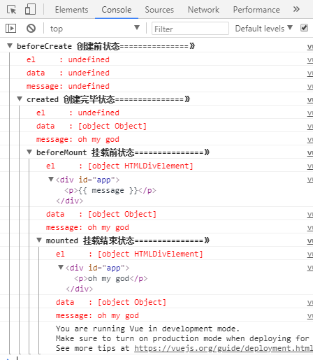

### vue的生命周期
Vue实例有一个完整的生命周期，也就是开始创建，初始化数据，编译模板，挂载Dom，渲染 更新 渲染，销毁等一系列过程，称这是生命周期，通俗说就是从创建到销毁的过程，就是生命周期。  
1. 实例，组件通过new Vue()创建出来后初始化事件和生命周期，然后就会执行beforeCreate钩子函数，这个时候数据还没有挂载出来，只是个空壳，无法访问到数据和dom。 
2. 挂载数据，绑定事件等等，然后执行created函数，这个时候已经可以使用到数据，也可以更改数据，在这里更改数据不会触发updated函数，在这里可以在渲染前倒数第二次更改数据的机会，不会触发其它的钩子函数，一般可以在这里做初始数据的获取。
3. 接下来开始，找到实力或组件对应的模板，编译模板为虚拟dom放入到render函数中准备渲染，然后执行before钩子函数，在这个函数中虚拟dom已经创建完成，马上就要渲染，在这里更改数据，不会触发updated，在这里可以在渲染前最后一次更改数据，也不会触发其它钩子函数，一般可以在这里做初始数据的获取。  
4. 接下来开始render，渲染出真实的dom，然后执行mounted钩子函数，此时，组件已经出现在页面中，数据，真实的dom已经处理好了，事件都已经挂载好了，可以在这里操作真实的dom等事件
5. 当组件或实例的数据更新后，会立即执行beforeUpdate，然后vue的虚拟dom机制会重新构建虚拟dom与上次的虚拟dom数对比之后重新渲染。  
6. 当更新完成后，执行updated，数据已经更改完成，dom也重新render完成，可以操作更新后的虚拟dom
7. 经过$destroy方法后，立即执行beforeDestroy，一般在这里做一些善后工作，清除非指令绑定的事件等
8. 组件的数据绑定，监听，去掉后只剩dom空壳，这时，执行destroyed。  
通过下面的这段代码，可以更加清楚的了解。
```bash
<!DOCTYPE html>
<html lang="en">
<head>
	<meta charset="UTF-8">
	<title>vue</title>
	<script src="https://cdn.jsdelivr.net/npm/vue/dist/vue.js"></script>
</head>
<body>
<div id="app">
     <p>{{ message }}</p>
</div>
</body>
</html>
<script>
  var app = new Vue({
      el: '#app',
      data: {
          message : "oh my god" 
      },
       beforeCreate: function () {
            console.group('beforeCreate 创建前状态===============》');//"%c%s", "color:red"让输出的字体变红
            console.log("%c%s", "color:red" , "el     : " + this.$el); //undefined
            console.log("%c%s", "color:red","data   : " + this.$data); //undefined 
            console.log("%c%s", "color:red","message: " + this.message)  
        },
        created: function () {
            console.group('created 创建完毕状态===============》');
            console.log("%c%s", "color:red","el     : " + this.$el); //undefined
            console.log("%c%s", "color:red","data   : " + this.$data); //已被初始化 
            console.log("%c%s", "color:red","message: " + this.message); //已被初始化
        },
        beforeMount: function () {
            console.group('beforeMount 挂载前状态===============》');
            console.log("%c%s", "color:red","el     : " + this.$el); //已被初始化
            console.log(this.$el);
            console.log("%c%s", "color:red","data   : " + this.$data); //已被初始化  
            console.log("%c%s", "color:red","message: " + this.message); //已被初始化  
        },
        mounted: function () {
            console.group('mounted 挂载结束状态===============》');
            console.log("%c%s", "color:red","el     : " + this.$el); //已被初始化
            console.log(this.$el);    
            console.log("%c%s", "color:red","data   : " + this.$data); //已被初始化
            console.log("%c%s", "color:red","message: " + this.message); //已被初始化 
        },
        beforeUpdate: function () {
            console.group('beforeUpdate 更新前状态===============》');
            console.log("%c%s", "color:red","el     : " + this.$el);
            console.log(this.$el);   
            console.log("%c%s", "color:red","data   : " + this.$data); 
            console.log("%c%s", "color:red","message: " + this.message); 
        },
        updated: function () {
            console.group('updated 更新完成状态===============》');
            console.log("%c%s", "color:red","el     : " + this.$el);
            console.log(this.$el); 
            console.log("%c%s", "color:red","data   : " + this.$data); 
            console.log("%c%s", "color:red","message: " + this.message); 
        },
        beforeDestroy: function () {
            console.group('beforeDestroy 销毁前状态===============》');
            console.log("%c%s", "color:red","el     : " + this.$el);
            console.log(this.$el);    
            console.log("%c%s", "color:red","data   : " + this.$data); 
            console.log("%c%s", "color:red","message: " + this.message); 
        },
        destroyed: function () {
            console.group('destroyed 销毁完成状态===============》');
            console.log("%c%s", "color:red","el     : " + this.$el);
            console.log(this.$el);  
            console.log("%c%s", "color:red","data   : " + this.$data); 
            console.log("%c%s", "color:red","message: " + this.message)
        }
    })
</script>
```
在chrome浏览器打开，F12看console就能发现

> beforecreated：el 和 data 并未初始化 
> created:完成了 data 数据的初始化，el没有
> beforeMount：完成了 el 和 data 初始化 el还是 {{message}}
> mounted ：完成挂载 message的值已经渲染进去了
之后在下面执行一下app.message= 'hello vue';


立即执行beforeUpdate，更新后执行updated 数据完成更新 也重新渲染  
最后在执行app.$destroy();

之后将不能进行操作  
输入app.message="1234567890"!  
不会像之前一样触发钩子函数 只会显示"123456789"


